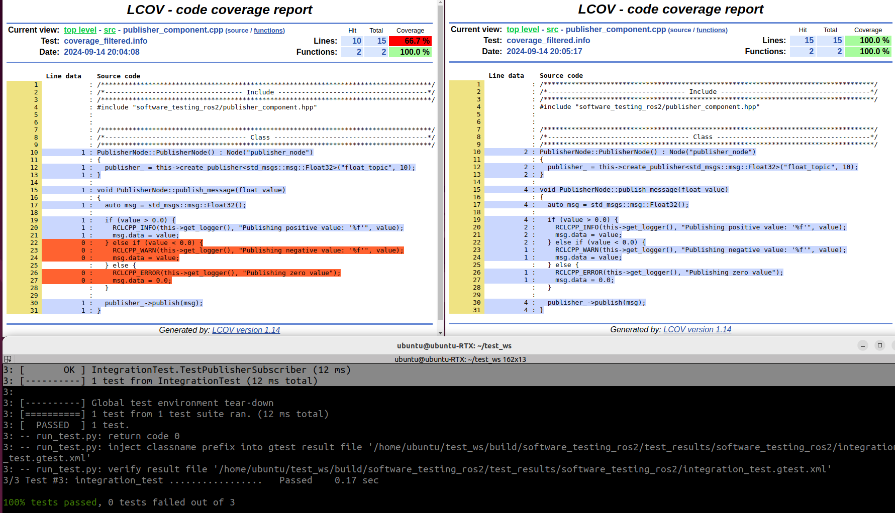

# software_testing_ros2

This package is designed for testing ROS 2 software components, including unit, component, and integration tests.

## Supported ROS 2 distributions

[![humble][humble-badge]][humble]
[![ubuntu22][ubuntu22-badge]][ubuntu22]

## Requirements
- Ubuntu OS PC
  - Ubuntu 22.04 Humble

## Usage

To build and run unit tests, component tests, and integration tests, execute the following commands:

```bash
# Unit Testing
cd ~/test_ws
colcon build --symlink-install --cmake-args -DCMAKE_BUILD_TYPE=Debug -DBUILD_UNIT_TEST=ON

# Component Testing
cd ~/test_ws
colcon build --symlink-install --cmake-args -DCMAKE_BUILD_TYPE=Debug -DBUILD_COMPONENT_TEST=ON

# Integration Testing
cd ~/test_ws
colcon build --symlink-install --cmake-args -DCMAKE_BUILD_TYPE=Debug -DBUILD_INTEGRATION_TEST=ON
```

```bash
colcon test
colcon test --event-handlers console_cohesion+
colcon test-result --verbose
```

## Checking Coverage Report and Test Result.

### Checking Coverage Report with lcov

To view the coverage report using `lcov`, follow these steps:

```bash
cd build/software_testing_ros2
cmake --build . --target coverage
xdg-open coverage_html_report/index.html
```




### Checking Test Result.

To view the XML report of test results, navigate to the following directory and open the XML file:

```bash
cd ~/test_ws/build/software_testing_ros2/test_results/software_testing_ros2
```

## License
This repository is licensed under the MIT license, see LICENSE.

[humble-badge]: https://img.shields.io/badge/-HUMBLE-orange?style=flat-square&logo=ros
[humble]: https://docs.ros.org/en/humble/index.html

[ubuntu22-badge]: https://img.shields.io/badge/-UBUNTU%2022%2E04-blue?style=flat-square&logo=ubuntu&logoColor=white
[ubuntu22]: https://releases.ubuntu.com/jammy/
