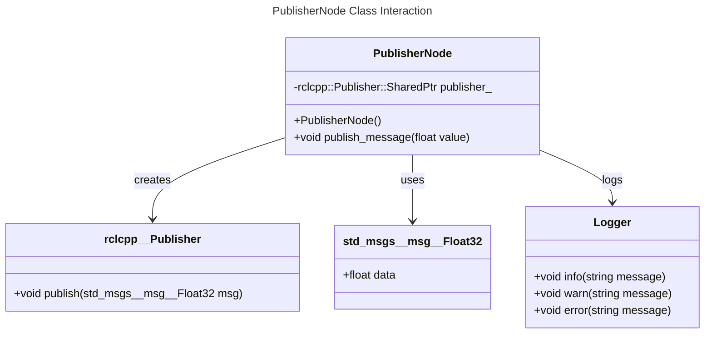

# Specification

## Overview

The `PublisherNode` class is a ROS 2 node responsible for publishing messages of type `std_msgs::msg::Float32` to the `float_topic` topic. It includes methods to handle various types of messages and logs appropriate information based on the message value.

## Architecture Diagram

| **Component**            | **Description**                                                 | **Responsibilities**                                  |
|--------------------------|-----------------------------------------------------------------|-------------------------------------------------------|
| **PublisherNode**        | Main class responsible for publishing messages.                 | - Initializes the publisher.   - Publishes messages. |
| **rclcpp::Publisher**    | ROS 2 publisher class template.                                 | - Publishes messages of type `std_msgs::msg::Float32`. |
| **std_msgs::msg::Float32** | Message type used for publishing float values.                  | - Contains the `data` field to store the float value. |
| **Logger**               | Utility for logging messages in ROS 2.                          | - Logs messages at different severity levels (info, warn, error). |

## Class Diagram

The following class diagram illustrates the structure and relationships between `PublisherNode`, `std_msgs::msg::Float32`, and `rclcpp::Publisher<std_msgs::msg::Float32>`:

